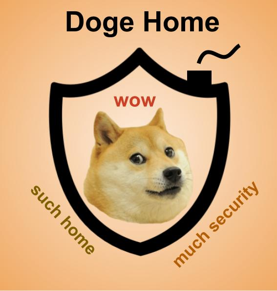

# Doge Home

A 100% secure smart home written in rust for the raspberry pi

## Getting Started

### Emulate the raspberi pi 1

Dockerpi emulate a raspberypi in a docker using qemu

```bash
sudo docker run -it -p 5022:5022 -v $HOME/.dockerpi:/sdcard lukechilds/dockerpi
```

It will create an image for the raspberry pi and launch this image.
ssh is not active by default. in order to activate ssh, login into the raspberry pi:

```bash
login: pi
password: raspberry
```

Go to `/etc/ssh/sshd_config` and uncomment the following lines:

```bash
#Port 22
#AddressFamily any
#ListenAddress 0.0.0.0
#ListenAddress ::
```

then

```bash
systemctl enable ssh
systemctl start ssh
```

This way you can connect to your emulated raspberry pi:

```bash
ssh -p 5022 pi@localhost
```

### cross compiling rust for the raspberry pi

Raspberry pi 0/1 use arm and 2/3 use armv7. In order to compile your code from your x86/x64 machine, you need to use specific tools.
Cross compilation is done using cross:
<https://github.com/rust-embedded/cross>

To install cross, execute:
```bash 
cargo install cross
```

The `deploy.sh` script compile, deploy, and execute the binary on the targeted raspberry pi. You must add your user to the docker group in order to compile with cross. If ssh does not work, check if you dockerpi is running.

## Running the tests

### Unit test

`cargo test --tests` 
Nothing is tested yet.

### klee tests

To simplify klee installation, we will use the `rust-klee-docker`: <https://github.com/BajacDev/rust-klee-docker>

```
docker run --rm -it -v /path/to/doge-home:/home/arch/doge-home rkd
```

then, in the conatainer:

```
cd doge-home
cargo klee --example it_crashes
```

This should yield `KLEE: ERROR: examples/it_crashes.rs:17: abort failure`

## Contributing

Please read [CONTRIBUTING.md](CONTRIBUTING.md) for details on our code of conduct, and the process for submitting pull requests to us.

## Authors

* **Baptiste Jacquemot**
* **Thomas Berkane**
* **Thomas Bienaimé**

## License

This project is licensed under the MIT License - see the [LICENSE.md](LICENSE.md) file for details

## Acknowledgments

* [Dependable Systems Lab](https://dslab.epfl.ch/)
* Our skills